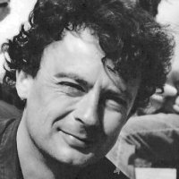

class: middle, center, title-slide

# Advanced Machine Learning

Course syllabus

  
Prof. Pierre Geurts 
[p.geurts@uliege.be](p.geurts@uliege.be) 

Prof. Gilles Louppe 
[g.louppe@uliege.be](g.louppe@uliege.be) 

Prof. Louis Wehenkel 
[l.wehenkel@uliege.be](l.wehenkel@uliege.be)

---

class: middle, center

.italic[To know, read.

To learn, write.

To master, teach.]

(Hindu proverb)

---

# Us

This course is given by:
- Pierre Geurts ([p.geurts@uliege.be](p.geurts@uliege.be))
- Gilles Louppe ([g.louppe@uliege.be](mailto:g.louppe@uliege.be))
- Louis Wehenkel ([l.wehenkel@uliege.be](l.wehenkel@uliege.be))
- Researchers from the department
- ... and you!

 

.center[
.circle.width-20[] &nbsp;
.circle.width-20[] &nbsp;
.circle.width-20[] 

]

---

# Lectures

- This course is organized as a **journal club**.
- Reading and presentation of recent machine learning research papers.
- Every week, one of us will:
    - select a research paper
    - introduce the necessary background
    - present the paper
      - or watch a recorded talk from the authors
    - discuss and criticize its content.
- Goal: training for research and development in machine learning.

---

class: middle

.center.width-100[]

.center[Read the papers!]

.footnote[Credits: Jorge Cham, [PHD Comics](http://phdcomics.com/comics/archive.php?comicid=963).]

---

# Seminars

A couple of lectures will be organized as seminars:
- either with invited speakers
- or with recorded talks, followed by a discussion.

---

# Requirements

We strongly recommend to follow this course only **after** having followed both:

- ELEN0062 Introduction to machine learning
- INFO8010 Deep learning

---

# Course hub

All important information about the course is available on the course web page [github.com/glouppe/info8004-advanced-machine-learning](https://github.com/glouppe/info8004-advanced-machine-learning).
- Schedule
- Slides and materials
- Papers to read.

---

# Reading and presentation assignment

- Read a selected machine learning paper.
- Prepare a 30-minute lecture, covering the necessary background and discussing the paper.
- Write a short summary report.

More details to be announced later.

---

# Evaluation

- Exam (60%)
- Reading and presentation assignment (40%)

---

class: end-slide, center
count: false

Let's start!
