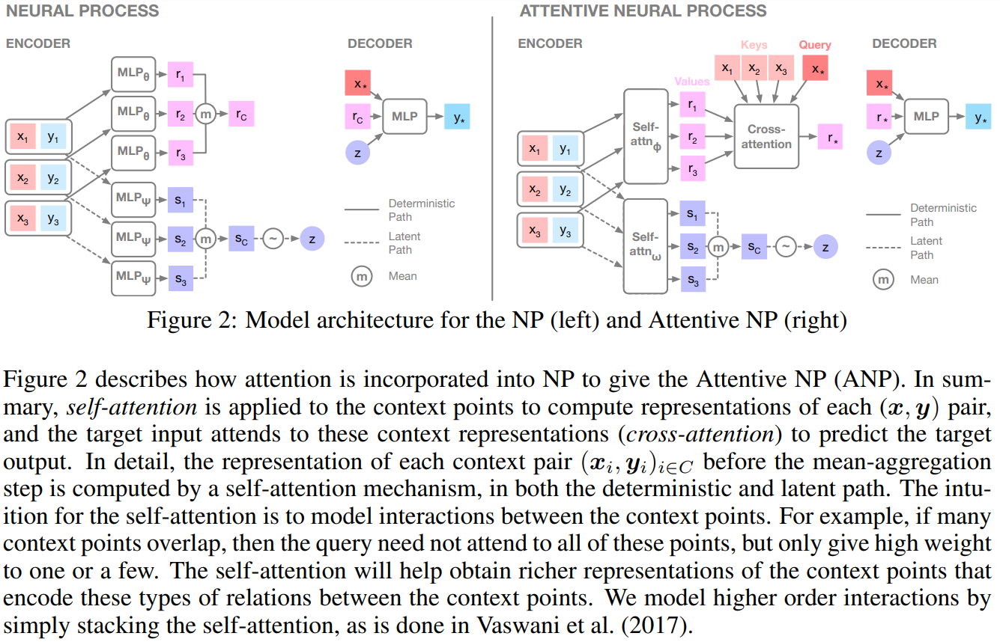

class: middle, center, title-slide

# Advanced Machine Learning

Gaussian & Neural Processes

.bold[Paper]: Marta Garnelo et al., .italic[Conditional neural processes], 
in International Conference on Machine Learning 2018. [[Code](https://github.com/deepmind/neural-processes)]

  
Gilles Louppe 
[g.louppe@uliege.be](g.louppe@uliege.be)

???

Follow-up: implicit neural representations

---

# Supervised learning

.center.width-90[]

Supervised learning = function approximation given a finite set of observations.

- Data $\\\{(x\_i, y\_i)\\\}\_{i=0}^{n-1}$, with inputs $x\_i \in \mathcal{X}$ and outputs $y\_i \in \mathcal{Y}$.
- Assume outputs represent evaluations $y\_i = f(x\_i)$ of some unknown function $f: \mathcal{X} \to \mathcal{Y}$, which may be fixed or a realization of some random function.

.footnote[Credits: Marta Garnelo et al., arXiv:[1807.01613](https://arxiv.org/abs/1807.01613).]

---

class: middle

.center.width-90[]

The traditional approach to SL is to define a parametric function $g: \mathcal{X} \to \mathcal{Y}$ for each new task and spend the bulk of the computation on a costly fitting phase.
- Prior information about $f$ is specified via the architecture of $g$, the loss function, or the training details.
- Since the extent of prior knowledge that can be expressed in this way is limited, the amount of training data required is usually large.

.footnote[Credits: Marta Garnelo et al., arXiv:[1807.01613](https://arxiv.org/abs/1807.01613).]

---

class: middle

An alternative is to specify a distribution **over functions** $g$, also known as **stochastic processes**.
- The prior knowledge about $f$ is captured in the distributional assumptions of the process prior.
- Learning corresponds to Bayesian inference over the functional space conditioned on the observed values.

*Gaussian processes* are an example of this approach to supervised learning.

---

class: middle

# Gaussian processes

---

# Multivariate Gaussian distribution

Let  $\mathbf{f}$ be a random variable that follows a multivariate
Gaussian distribution $p(\mathbf{f})$.

Let us partition its dimensions into two
sets $A$ and $B$, such that:

$$
\begin{aligned}
&\underbrace{f\_1, \ldots, f\_i}\_{\mathbf{f}\_A},\underbrace{f\_{i+1}, \ldots, f\_N}\_{\mathbf{f}\_B}  \sim \mathcal{N}(\mu, K) \\\\
&\mu = \begin{bmatrix}\mu\_A\\\\
                      \mu\_B\end{bmatrix} \in \mathbb{R}^N\\\\
&K = \begin{bmatrix}K\_{AA} & K\_{AB} \\\\
                    K\_{BA} & K\_{BB}\end{bmatrix} \in \mathbb{R}^{N \times N}
\end{aligned}
$$

---

class: middle

.center.width-40[]

## Marginal and conditional distributions

- The marginal distribution $p(\mathbf{f}\_A)$ of the multivariate Gaussian  $p(\mathbf{f})$ is a multivariate Gaussian such that
$$\mathbf{f}\_A \sim \mathcal{N}(\mu\_A, K\_{AA}).$$
- The conditional distribution $p(\mathbf{f}\_A|\mathbf{f}\_B)$ is a multivariate Gaussian such that
$${\mathbf{f}\_A}|{\mathbf{f}\_B}  \sim \mathcal{N}(\mu\_A + K\_{AB}K\_{BB}^{-1}({\mathbf{f}\_B} - \mu\_B), K\_{AA} - K\_{AB}K\_{BB}^{-1}K\_{BA}).$$

---

# Gaussian processes

Let us define a *stochastic process* as a random function $$f: \mathcal{X} \to \mathcal{Y},$$
such that for each finite sequence $\mathbf{x}\_{1:N} = (\mathbf{x}\_1, \ldots, \mathbf{x}\_N)$, with $\mathbf{x}\_i \in \mathcal{X}$, we define the marginal joint distribution over function values
$$Y\_{1:N} := (f(\mathbf{x}\_1), \ldots, f(\mathbf{x}\_N)).$$

---

class: middle

When these joint distributions are all defined as multivariate Gaussians, the resulting stochastic process is called a **Gaussian process**.

---

class: middle

... or put differently:

A **Gaussian process** is a (potentially infinite) collection
of random variables, such that the joint distribution of any finite
number them is multivariate Gaussian.

---

class: red-slide, middle

.center[
... or even more simply, a Gaussian process is a

.huge.bold[HUGE ⃰]

multivariate Gaussian distribution.
]

.footnote[ ⃰ Its dimension is the number of data points, possibly infinite.]

---

class: middle

.grid[
.kol-2-5[
## Gaussian distribution

$$\mathbf{x} \sim \mathcal{N}(\mu, K)$$

- Distribution over vectors.
- Fully specified by a mean and a covariance matrix.
- The position of the random variable in the vector plays the role of the index.

]
.kol-1-5[.center.italic[vs.]]
.kol-2-5[
## Gaussian process

$$f \sim \mathcal{GP}(m(\cdot), k(\cdot,\cdot))$$

- Distribution over functions.
- Fully specified by a mean function $m$ and a covariance function $k$.
- The argument of the random function plays the role of the index.

]
]

---

# Prior

For $m(\cdot)=0$ and for any set  $A = \mathbf{x}\_1, \ldots, \mathbf{x}\_M$ of target points, we compute the covariance matrix $K\_{AA}$, which defines a joint distribution $p(\mathbf{f}\_A)$
over function values at those points:
$$\begin{bmatrix} f(\mathbf{x}\_1)\\\\
                  \ldots \\\\
                  f(\mathbf{x}\_M) \end{bmatrix} \sim \mathcal{N}(\mathbf{0}, K\_{AA})$$

That is, we are marginalizing over the random variables not included in the target points.

???

We are marginalizing out infinitely many random variables!

---

class: middle

.center.width-80[]

---

# Posterior

Given observations $\mathcal{D} = (B = \mathbf{x}\_1, \ldots, \mathbf{x}\_N; \mathbf{f}\_B = f(\mathbf{x\_1}), \ldots, f(\mathbf{x\_N} ))$
and target points $A = \mathbf{x}\_1, \ldots, \mathbf{x}\_M$, we similarly derive the joint distribution
$$\begin{bmatrix}\mathbf{f}\_A\\\\
                 \mathbf{f}\_B\end{bmatrix} \sim \mathcal{N}(\mathbf{0}, \begin{bmatrix}K\_{AA} & K\_{AB} \\\\
                                                                                    K\_{BA} & K\_{BB}\end{bmatrix})$$
on which we can condition $\mathbf{f}\_B$ on the known values from $\mathcal{D}$,
resulting in the posterior distribution $p(\mathbf{f}\_A|\mathcal{D})$:

$$\mathbf{f}\_A \sim \mathcal{N}(K\_{AB}K\_{BB}^{-1}{\mathbf{f}\_B}, K\_{AA} - K\_{AB}K\_{BB}^{-1}K\_{BA})$$

Note that due to the inversion of $K\_{BB}$, the complexity for (exact) posterior inference is $O(N^3)$.

---

class: middle

.center.width-80[]

---

# Kernels

The kernel or covariance function $k(\cdot,\cdot)$ encodes the covariance between pairs of random variables $f(\mathbf{x}_i), f(\mathbf{x}_j)$.
It must be positive semi-definite and symmetric.

Popular examples include:
- The squared exponential function (RBF)
- The Matern kernel
- The linear kernel
- The polynomial kernel
- The white noise kernel

Kernels can be composed together to describe complex interactions. They are a way to incorporate prior knowledge about the class of functions.

---

class: middle

## Squared exponential function

$$k(\mathbf{x}\_i, \mathbf{x}\_j) = \sigma^2 \exp(-  \frac{||\mathbf{x}\_i - \mathbf{x}\_j||^2}{2 \ell^2})$$

Hyper-parameters:
- The length scale $\ell$ describes the smoothness of the function.
- The output variance $\sigma^2$ determines the average distance of the function away from its mean.

???

Intuition:
- When $\ell$ is large, the argument tends to $0$, therefore the exponential tends to $1$. Elements are highly correlated!
- When $\ell$ is small, the argument tends to $-\infty$, therefore the exponential tends $0$. Elements are not correlated!

---

class: middle

.center.width-100[]

---

class: middle

.center.width-100[]

---

class: middle

.center.width-100[]

---

class: middle

.center.width-50[]

$$\begin{aligned}
k = &\,\, 66^2 \text{RBF}(\ell=67) \\\\
    &+ 2.4^2 \text{RBF}(\ell=90) \times \text{ExpSineSquared}(\ell=1.3) \\\\
    &+ 0.66^2 \text{RationalQuadratic}(\ell=2, \alpha=0.78) \\\\
    &+ 0.18^2 \text{RBF}(\ell=0.134) \\\\
    &+ \text{WhiteKernel}()
\end{aligned}$$

---

class: middle

## Hyper-parameters

- So far we have assumed that the Gaussian process prior $p(\mathbf{f})$ was specified a priori.
- However, this distribution itself has  parameters. E.g., $\ell$ and $\sigma$ when using the squared exponential function.
- Let $\theta$ denote the vector of hyper-parameters. How do we set $\theta$?

---

class: middle

## Maximum marginal likelihood

Given observations $\mathcal{D} = (B = \mathbf{x}\_1, \ldots, \mathbf{x}\_N; \mathbf{f}\_B = f(\mathbf{x}\_1), \ldots, f(\mathbf{x}\_N))$,
we have the prior
$$\begin{bmatrix} f(\mathbf{x}\_1)\\\\
                      \ldots \\\\
                      f(\mathbf{x}\_N) \end{bmatrix} \sim \mathcal{N}(\mathbf{0}, K\_{BB;\theta})$$
at the observation points.

Let us select $\theta$ to maximize the likelihood $p(\mathbf{f}\_B;\theta)$ of the observations under that prior:
$$
\begin{aligned}
    \theta^* &= \arg \min\_\theta - \log p(\mathbf{f}\_B;\theta) \\\\
             &= \arg \min\_\theta - \frac{1}{2} \log \det K\_{BB;\theta} - \frac{1}{2} \mathbf{f}\_B^T K_{BB;\theta}^{-1} \mathbf{f}\_B + c
\end{aligned}
$$

???

This is just the same as maximum likelihood estimation on training data.

---

class: middle

.center.width-80[]

---

# Noisy observations

So far we assumed noise-free observations $\mathbf{f}\_B = f(\mathbf{x}\_B)$.

In more realistic situations, it is typical to instead consider noisy observations $\mathbf{y}\_B = f(\mathbf{x}\_B) + \epsilon$.

Assuming iid Gaussian noise $\epsilon$ with variance $\sigma^2\_N$, the joint distribution of noisy observations of $f$ at observation points and of the true values of $f$ at target points is:
$$\begin{bmatrix}\mathbf{f}\_A\\\\
                 \mathbf{y}\_B\end{bmatrix} \sim \mathcal{N}\left(\mathbf{0}, \begin{bmatrix}K\_{AA} & K\_{AB} \\\\
                                                                                    K\_{BA} & K\_{BB} + \sigma^2\_N I\end{bmatrix}\right),$$
which results in the posterior
$$\mathbf{f}\_A \sim \mathcal{N}\big(K\_{AB}[K\_{BB} + \sigma^2\_N I]^{-1}{\mathbf{f}\_B}, K\_{AA} - K\_{AB}[K\_{BB} + \sigma^2\_N I]^{-1}K\_{BA}\big).$$

???

Equivalent to say we observe realizations of a random function.

---

class: middle

.center.width-80[]

---

# Summary

- Gaussian processes $=$ multivariate Gaussian in infinite dimension.
- Prior knowledge about $f$ is captured in the distributional assumptions about the process prior. For example, assumptions on the smoothness of $f$ is captured a priori via a parametric kernel function.
- Learning corresponds to posterior inference over the functional space conditioned on observations, and $g$ is taken to be a random function distributed according to the predictive posterior distribution.
- Exact inference does not scale to many observations ($O(N^3)$).

---

class: middle

# Conditional neural processes

---

class: middle

## How do I read a paper?

1. Read title, abstract and conclusions (what is this about?).
2. Hop to the main figures.
3. If that looks interesting, I dive into the technical details:
    - Understand the method
    - Read through the experiments (do they support the claims?)

---

class: middle

.width-60.center[]

---

class: middle

.width-60.center[]

---

# Conditional neural process

A Conditional Neural Process (CNP) is a conditional distribution over functions trained to model the empirical conditional distributions of functions $f \sim P$.

---

class: middle

.center.width-60[]

A Conditional Neural Process
- embeds each observation through a neural **encoder** $h$, that takes pairs of $(x\_i,y\_i)$ context values and produces a representation $r\_i = h((x\_i,y\_i))$ for each of the pairs;
- aggregates these embeddings $r\_i$ into a further embedding $r$ of fixed dimension with a symmetric *aggregator* $a$,
- and produces through a neural **decoder** $g$ distributions for $f(x\_T)$ at the target points $x\_T$, conditioned on the embedding $r$.

.footnote[Credits: Marta Garnelo et al., arXiv:[1807.01613](https://arxiv.org/abs/1807.01613).]

---

class: middle

Specifically, given a set of observations $O$, a CNP defines a conditional stochastic process $Q\_\theta$ that defines distributions over $f(x)$ for targets $x\in T$. Permutation invariance w.r.t. $T$ is enforced by assuming a factored structure such that
$$Q\_\theta(f(T)|O,T) = \prod\_{x\_j \in T} Q\_\theta(f(x\_j)|O,x\_j).$$

Then,
$$
\begin{aligned}
r\_i &= h\_\theta(x\_i, y\_i)  &\forall (x\_i,y\_i) \in O \\\\
r &= (r\_1 + ... + r\_n) / n   & \\\\
\phi\_j &= g\_\theta(x\_j, r)    &\forall x\_j \in T
\end{aligned}
$$
where $\phi\_j$ are parameters for $Q\_\theta(f(x\_j)|O, x\_j) = Q\_\theta(f(x\_j)|\phi\_j)$.
- For regression tasks, $\phi\_j$ parameterizes the mean and the variance $\phi\_j=(\mu\_j, \sigma\_j^2)$ of a Gaussian distribution.
- For classification tasks, $\phi\_j$ parameterizes the logits of the class probabilities $p\_c$ over the classes of a categorical distribution.

---

class: middle

## Exchangeability

A CNP is permutation invariant in observations and targets.
- For observations, permutation invariance is guaranteed through the symmetric aggregator.
- For targets, permutation invariance is guaranteed through the factored structure of $Q\_\theta$.

---

class: middle

## Consistency

If we marginalise out a part of the sequence the resulting marginal distribution is the same as that defined on the original sequence.

More precisely, if $1 \leq m \leq n$, then
$$Q\_\theta(\\\{y\_i\\\}\_{i=0}^{m-1}|O) = \int Q\_\theta(\\\{y\_i\\\}\_{i=0}^{n-1}|O) d\_{y\_{m:n-1}}.$$

For regression, this property is guaranteed by construction, as $Q\_\theta$ is defined as a Gaussian.

---

class: middle

As stated by the Kolmogorov Extension Theorem, exchangeability and consistency are *sufficient conditions* to a define a stochastic process.

Therefore, CNPs are stochastic processes, just like GPs.

---

class: middle

## Time complexity

A CNP is scalable, achieving running time complexity of $O(n+m)$, for making $m$ predictions with $n$ observations.

---

class: middle

## Training

Let $f\sim P$, $O = \\\{(x\_i, y\_i)\\\}\_{i=0}^{n-1}$, $N \sim \mathcal{U}[0, ..., n-1]$ and $O\_N = \\\{(x\_i, y\_i)\\\}\_{i=0}^{N} \subset O$.

The training objective is then given by
$$\mathcal{L}(\theta) = -\mathbb{E}\_{f\sim P} \left[ \mathbb{E}\_N \left[ \log Q\_\theta(\\\{y\_i\\\}\_{i=0}^{n-1} | O\_N, \\\{x\_i\\\}\_{i=0}^{n-1} \right] \right].$$

That is, $Q\_\theta$ is trained by asking it to predict $O$ conditioned on a randomly chosen subset of $O$.

---

class: middle

.width-60.center[]

---

class: middle

## Experiment 1: 1D regression

.grid[
.kol-1-2[.width-100.center[]]
.kol-1-2[.width-80.center[]]
]

---

class: middle

## Experiment 2: Image completion

.width-50.center[]

---

class: middle

.width-100.center[]

---

class: middle, center

.width-60.center[]

**!!!**

---

class: middle

## Experiment 3: One-shot learning

.width-50.center[]

---

class: middle, center

What do you think?

Do the experiments support the claims?

???

- Shift the burden of imposing prior knowledge from analytic prior to empirical data.
=> Partly shown from Figure 2. Would have been nice to see another easy example, such as Mauna Loa.

---

class: middle
count: false

# Follow-ups

---

class: middle

## Neural Processes (Garnelo et al, 2018)

.width-60.center[]
.width-80.center[]

.footnote[Credits: Marta Garnelo et al., arXiv:[1807.01622](https://arxiv.org/abs/1807.01622).]

---

class: middle

.center[
<video loop autoplay controls preload="auto" height="400" width="650">
  <source src="./figures/lec1/np.mp4" type="video/mp4">
</video>
]

.footnote[Credits: [Kaspar Martens, 2018](https://kasparmartens.rbind.io/post/np/).]

---

class: middle

.width-100.center[]

---

class: middle

## Attentive neural processes (Kim et al, 2019)

.width-100.center[]

.footnote[Credits: Kim et al., arXiv:[1901.05761](https://arxiv.org/abs/1901.05761).]

---

class: middle

## Generative Query Networks (Eslami et al, 2018)

.width-60.center[]

---

class: middle, center, black-slide

<iframe width="600" height="450" src="https://www.youtube.com/embed/oSZkDuDoFAI" frameborder="0" allowfullscreen></iframe>

---

class: middle, center, black-slide

<iframe width="600" height="450" src="https://www.youtube.com/embed/G-kWNQJ4idw" frameborder="0" allowfullscreen></iframe>

---

class: end-slide, center
count: false

The end.
