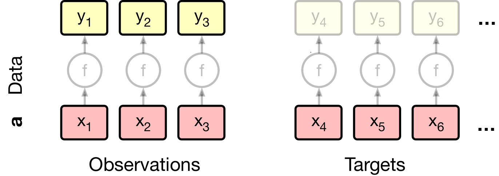
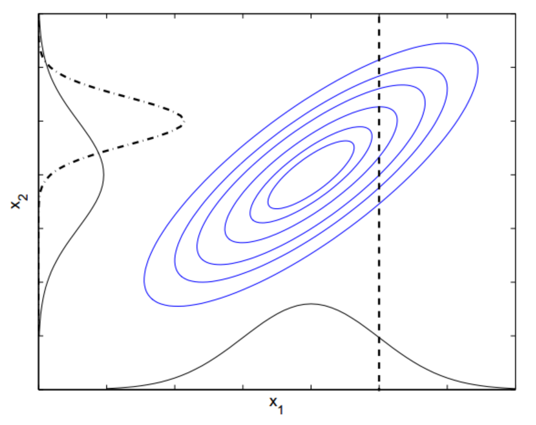
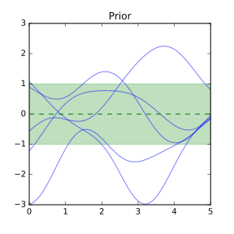
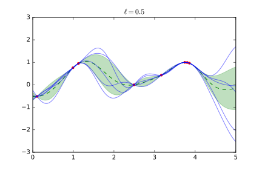
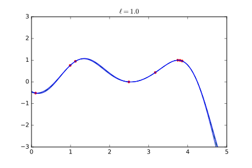
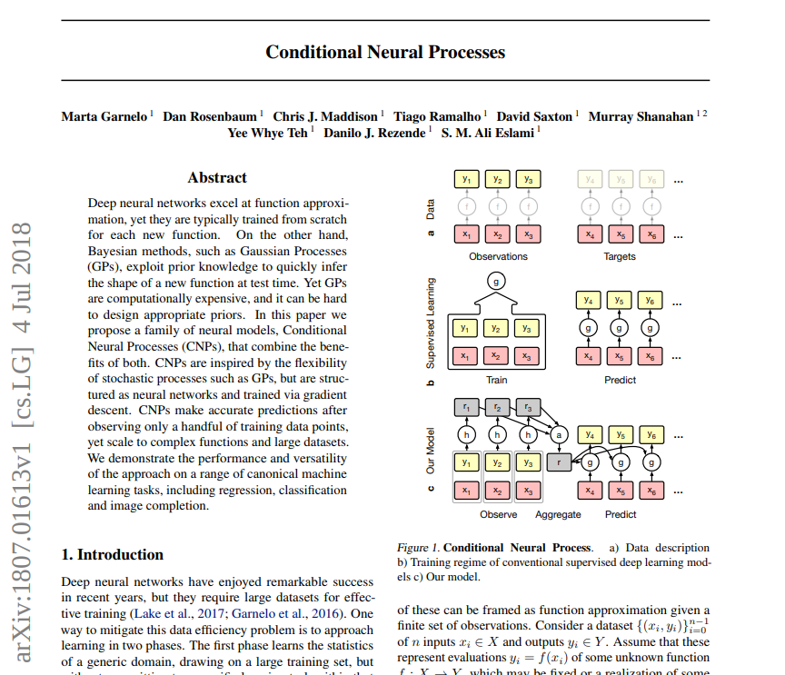

class: middle, center, title-slide

# Advanced Machine Learning

Lecture 2

.bold[Paper]: Marta Garnelo et al., .italic[Conditional neural processes], 2018.

  
Prof. Gilles Louppe 
[g.louppe@uliege.be](g.louppe@uliege.be)

???

https://vimeo.com/312299226

---

# Supervised learning

 
.center.width-90[]
 

Supervised learning (SL) = function approximation given a finite set of observations.

- Data $\\\{(x\_i, y\_i)\\\}\_{i=0}^{n-1}$, with inputs $x\_i \in \mathcal{X}$ and outputs $y\_i \in \mathcal{Y}$.
- Assume outputs represent evaluations $y\_i = f(x\_i)$ of some unknown function $f: \mathcal{X} \to \mathcal{Y}$, which may be fixed or a realization of some random function.

.footnote[Credits: Marta Garnelo et al., arXiv:[1807.01613](https://arxiv.org/abs/1807.01613).]

---

class: middle

.center.width-90[]
 

The traditional approach to SL is to define a parametric function $g: \mathcal{X} \to \mathcal{Y}$ for each new task and spend the bulk of the computation on a costly fitting phase.
- Prior information about $f$ is specied via the architecture of $g$, the loss function, or the training details.
- Since the extent of prior knowledge that can be expressed in this way is limited, the amount of training data required is usually large.

.footnote[Credits: Marta Garnelo et al., arXiv:[1807.01613](https://arxiv.org/abs/1807.01613).]

---

class: middle

An alternative is to specify a distribution **over functions** $g$, also known as **stochastic processes**.
- The prior knowledge about $f$ is captured in the distributional assumptions of the process prior.
- Learning corresponds to Bayesian inference over the functional space conditioned on the observed values.

*Gaussian processes* are an example of this approach to supervised learning.

---

class: middle

# Gaussian processes

---

# Multivariate Gaussian distribution

Let  $\mathbf{f}$ be a random variable that follows a multivariate
Gaussian distribution $p(\mathbf{f})$.

Let us partition its dimensions into two
sets $A$ and $B$, such that:

$$
\begin{aligned}
&\underbrace{f\_1, \ldots, f\_i}\_{\mathbf{f}\_A},\underbrace{f\_{i+1}, \ldots, f\_N}\_{\mathbf{f}\_B}  \sim \mathcal{N}(\mu, K) \\\\
&\mu = \begin{bmatrix}\mu\_A\\\\
                      \mu\_B\end{bmatrix} \in \mathbb{R}^N\\\\
&K = \begin{bmatrix}K\_{AA} & K\_{AB} \\\\
                    K\_{BA} & K\_{BB}\end{bmatrix} \in \mathbb{R}^{N \times N}
\end{aligned}
$$

---

class: middle

.center.width-40[]

## Marginal and conditional distributions

- The marginal distribution $p(\mathbf{f}\_A)$ of the multivariate Gaussian  $p(\mathbf{f})$ is a multivariate Gaussian such that
$$\mathbf{f}\_A \sim \mathcal{N}(\mu\_A, K\_{AA}).$$
- The conditional distribution $p(\mathbf{f}\_A|\mathbf{f}\_B)$ is a multivariate Gaussian such that
$${\mathbf{f}\_A}|{\mathbf{f}\_B}  \sim \mathcal{N}(\mu\_A + K\_{AB}K\_{BB}^{-1}({\mathbf{f}\_B} - \mu\_B), K\_{AA} - K\_{AB}K\_{BB}^{-1}K\_{BA}).$$

---

# Gaussian processes

Let us define a *stochastic process* as a random function $$f: \mathcal{X} \to \mathcal{Y},$$
such that for each finite sequence $\mathbf{x}\_{1:N} = (\mathbf{x}\_1, \ldots, \mathbf{x}\_N)$, with $\mathbf{x}\_i \in \mathcal{X}$, we define the marginal joint distribution over function values
$$Y\_{1:N} := (f(\mathbf{x}\_1), \ldots, f(\mathbf{x}\_N)).$$

$\Rightarrow$ When these joint distributions are all multivariate Gaussians, the resulting stochastic process is called a **Gaussian process**.

---

class: middle

... or put differently:

A **Gaussian process** is a (potentially infinite) collection
of random variables, such that the joint distribution of any finite
number them is multivariate Gaussian.

---

class: red-slide, middle

.center[
... or even more simply, a Gaussian process is a

.huge.bold[HUGE&nbsp; ⃰]

multivariate Gaussian distribution.
]

.footnote[ ⃰ Its dimension is the number of data points, possibly infinite.]

---

class: middle

.grid[
.kol-2-5[
## Gaussian distribution

$$\mathbf{x} \sim \mathcal{N}(\mu, K)$$

- Distribution over vectors.
- Fully specified by a mean and a covariance matrix.
- The position of the random variable in the vector plays the role of the index.

]
.kol-1-5[.center.italic[vs.]]
.kol-2-5[
## Gaussian process

$$f \sim \mathcal{GP}(m(\cdot), k(\cdot,\cdot))$$

- Distribution over functions.
- Fully specified by a mean function $m$ and a covariance function $k$.
- The argument of the random function plays the role of the index.

]
]

---

# Prior

For $m(\cdot)=0$ and for any set  $A = \mathbf{x}\_1, \ldots, \mathbf{x}\_M$ of target points, we compute the covariance matrix $K\_{AA}$, which defines a joint distribution $p(\mathbf{f}\_A)$
over function values at those points:
$$\begin{bmatrix} f(\mathbf{x}\_1)\\\\
                  \ldots \\\\
                  f(\mathbf{x}\_M) \end{bmatrix} \sim \mathcal{N}(\mathbf{0}, K\_{AA})$$

That is, we are marginalizing over the random variables not included in the target points.

---

class: middle

.center.width-80[]

---

# Posterior

Given observations $\mathcal{D} = (B = \mathbf{x}\_1, \ldots, \mathbf{x}\_N; \mathbf{f}\_B = f(\mathbf{x\_1}), \ldots, f(\mathbf{x\_N} ))$
and target points $A = \mathbf{x}\_1, \ldots, \mathbf{x}\_M$, we similarly derive the joint distribution
$$\begin{bmatrix}\mathbf{f}\_A\\\\
                 \mathbf{f}\_B\end{bmatrix} \sim \mathcal{N}(\mathbf{0}, \begin{bmatrix}K\_{AA} & K\_{AB} \\\\
                                                                                    K\_{BA} & K\_{BB}\end{bmatrix})$$
on which we can condition $\mathbf{f}\_B$ on the known values from $\mathcal{D}$,
resulting in the posterior distribution $p(\mathbf{f}\_A|\mathcal{D})$:

$$\mathbf{f}\_A \sim \mathcal{N}(K\_{AB}K\_{BB}^{-1}{\mathbf{f}\_B}, K\_{AA} - K\_{AB}K\_{BB}^{-1}K\_{BA})$$

Note that due to the inversion of $K\_{BB}$, the complexity for (exact) posterior inference is $O(N^3)$.

---

class: middle

.center.width-80[]

---

# Kernels

The kernel or covariance function $k(\cdot,\cdot)$ encodes the covariance between pairs of random variables $\mathbf{x}_i, \mathbf{x}_j$.
It must be positive semi-definite and symmetric.

Popular examples include:
- The squared exponential function (RBF)
- The Matern kernel
- The linear kernel
- The polynomial kernel
- The white noise kernel

Kernels can be composed together to describe complex interactions. They are a way to incorporate prior knowledge about the class of functions.

---

class: middle

## Squared exponential function

$$k(\mathbf{x}\_i, \mathbf{x}\_j) = \sigma^2 \exp(-  \frac{||\mathbf{x}\_i - \mathbf{x}\_j||^2}{2 \ell^2})$$

Hyper-parameters:
- The length scale $\ell$ describes the smoothness of the function.
- The output variance $\sigma^2$ determines the average distance of the function away from its mean.

---

class: middle

.center.width-100[]

---

class: middle

.center.width-100[]

---

class: middle

.center.width-100[]

---

class: middle

## Hyper-parameters

- So far we have assumed that the Gaussian process prior $p(\mathbf{f})$ was specified a priori.
- However, this distribution itself has  parameters. E.g., $\ell$ and $\sigma$ when using the squared exponential function.
- Let $\theta$ denote the vector of hyper-parameters. How do we set $\theta$?

---

class: middle

## Maximum marginal likelihood

Given observations $\mathcal{D} = (B = \mathbf{x}\_1, \ldots, \mathbf{x}\_N; \mathbf{f}\_B = f(\mathbf{x}\_1), \ldots, f(\mathbf{x}\_N))$,
we can derive the prior
$$\begin{bmatrix} f(\mathbf{x}\_1)\\\\
                      \ldots \\\\
                      f(\mathbf{x}\_N) \end{bmatrix} \sim \mathcal{N}(\mathbf{0}, K\_{BB;\theta})$$
at the observation points.

Let us select $\theta$ to maximize the likelihood $p(\mathbf{f}\_B;\theta)$ of the observations under that prior:
$$
\begin{aligned}
    \theta^* &= \arg \min\_\theta - \log p(\mathbf{f}\_B;\theta) \\\\
             &= \arg \min\_\theta - \frac{1}{2} \log \det K\_{BB;\theta} - \frac{1}{2} \mathbf{f}\_B^T K_{BB;\theta}^{-1} \mathbf{f}\_B + c
\end{aligned}
$$

---

class: middle

.center.width-80[]

---

# Noisy observations

So far we assumed noise-free observations $\mathbf{f}\_B = f(\mathbf{x}\_B)$.

In more realistic situations, it is typical to instead consider noisy observations $\mathbf{y}\_B = f(\mathbf{x}\_B) + \epsilon$.

Assuming iid Gaussian noise $\epsilon$ with variance $\sigma^2\_N$, the joint distribution of noisy observations of $f$ at observation points and of the true values of $f$ at target points is:
$$\begin{bmatrix}\mathbf{f}\_A\\\\
                 \mathbf{y}\_B\end{bmatrix} \sim \mathcal{N}\left(\mathbf{0}, \begin{bmatrix}K\_{AA} & K\_{AB} \\\\
                                                                                    K\_{BA} & K\_{BB} + \sigma^2\_N I\end{bmatrix}\right),$$
which results in the posterior
$$\mathbf{f}\_A \sim \mathcal{N}\big(K\_{AB}[K\_{BB} + \sigma^2\_N I]^{-1}{\mathbf{f}\_B}, K\_{AA} - K\_{AB}[K\_{BB} + \sigma^2\_N I]^{-1}K\_{BA}\big).$$

---

class: middle

.center.width-80[]

---

# Summary

- Gaussian processes $=$ multivariate Gaussian in infinite dimension.
- Prior knowledge about $f$ is captured in the distributional assumptions about the process prior. For example, assumptions on the smoothness of $f$ is captured a priori via a parametric kernel function.
- Learning corresponds to Bayesian inference over the functional space conditioned on observations, and $g$ is taken to be a random function distributed according to the predictive posterior distribution.
- Exact inference does not scale to many observations ($O(N^3)$).

---

class: middle

# Conditional neural processes

---

class: middle

.width-100.center[]

---

how to read a paper?

---

Given a collection of joint distributions $\rho\_{x\_{1:N}}$, two conditions are necessary to be able to define a stochastic process $f$, such that $\rho\_{x\_{1:N}}$ is the marginal distributions of $(f(x\_1), \ldots, f(x\_N))$, for each finite sequence $x\_{1:N}$:

- *Exchangeability*:
- *Consistency*:

---

cnp architecture

???

as Yee Whye mentioned the other day, we can put prior knowledge into our model by choosing the data and training regime and letting the model learn these priors from the data rather than giving it a handcrafted kernel.

---

training

---

exp1

---

exp2

---

exp3

---

extension1 np (allow better sampling), latent variable model

---

extension2 attentive np

---

class: end-slide, center
count: false

The end.
