class: middle, center, title-slide

# Advanced Machine Learning

Lecture 5

.bold[Paper]: Gilles Louppe, Joeri Hermans and Kyle Cranmer,  .italic[Adversarial Variational Optimization of Non-Differentiable Simulators], 
in International Conference on
Artificial Intelligence and Statistics 2019.

  
Prof. Gilles Louppe 
[g.louppe@uliege.be](g.louppe@uliege.be)

---

class: middle

# Likelihood-free inference

---

class: middle, black-slide

.center.width-70[]

---

class: middle

.center.width-70[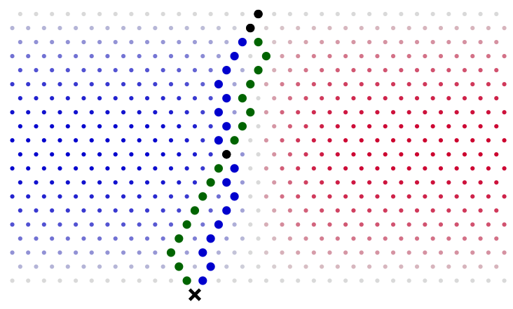]

The probability of ending in bin $x$ corresponds to the total probability of all the paths $z$ from start to $x$.

$$\begin{aligned}
p(x | \theta)
= \int p(x,z|\theta) dz
= \begin{pmatrix}
n \\\\
x
\end{pmatrix}
\theta^x (1-\theta)^{n-x}
\end{aligned}$$

---

# Inference

Given a set of realizations $\mathbf{d} = \\\{ x\_i \\\}$ at the bins, **inference** consists in determining the value of $\theta$ that best describes these observations.

For example, following the principle of maximum likelihood estimation, we have
$$\hat{\theta} = \arg \max\_\theta \prod_{x\_i \in \mathbf{d}} p(x\_i | \theta).$$

In general, when $p(x\_i | \theta)$ can be evaluated, this problem can be solved either analytically or using  optimization algorithms.

---

class: middle

What if we shift or remove some of the pins?

$$
\begin{aligned}
p(x | \theta) &= \underbrace{\int}\_\text{intractable!} p(x,z|\theta) dz \\\\
&\neq \begin{pmatrix}
n \\\\
x
\end{pmatrix}
\theta^x (1-\theta)^{n-x}
\end{aligned}
$$

Does this mean inference is no longer possible?

???

The probability of ending in bin $x$ still corresponds to the cumulative probability of all the paths from start to $x$:
$$p(x | \theta) = \int p(x,z|\theta) dz$$
- But this integral can no longer be simplified analytically!
- As $n$ grows larger, evaluating $p(x\|\theta)$ becomes **intractable** since the number of paths grows combinatorially.
- Generating observations remains easy: drop the balls.

---

class: middle

The Galton board is a *metaphore* of simulation-based science:
.grid.center[
.kol-2-5[Galton board device]
.kol-1-5[$\to$]
.kol-2-5[Computer simulation]
]
.grid.center[
.kol-2-5[Parameters $\theta$]
.kol-1-5[$\to$]
.kol-2-5[Model parameters $\theta$]
]
.grid.center[
.kol-2-5[Buckets $x$]
.kol-1-5[$\to$]
.kol-2-5[Observables $x$]
]
.grid.center[
.kol-2-5[Random paths $z$]
.kol-1-5[$\to$]
.kol-2-5[Latent variables $z$  (stochastic execution traces through simulator)]
]

Inference in this context requires **likelihood-free algorithms**.

---

class: middle

.center.width-100[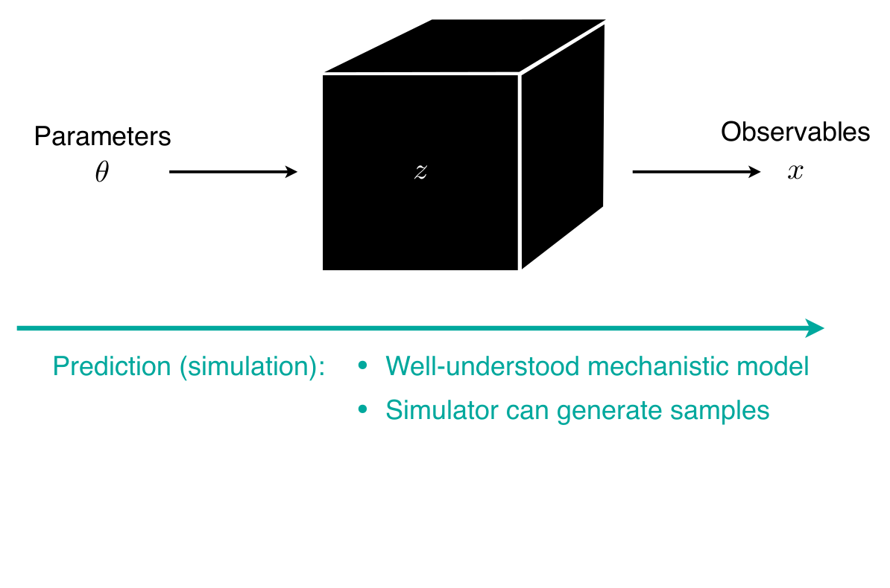]

.footnote[Credits: Johann Brehmer]

---

class: middle
count: false

.center.width-100[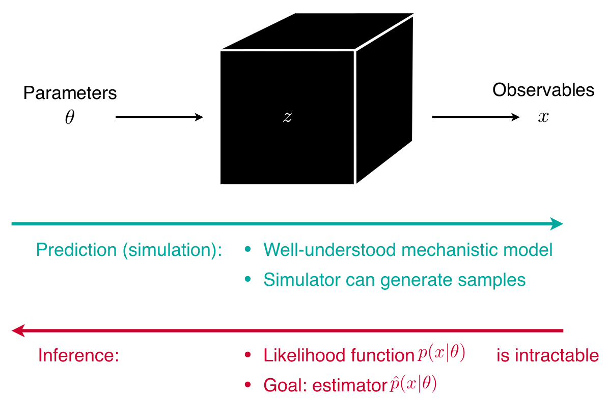]

.footnote[Credits: Johann Brehmer]

---

# Applications

.grid[
.kol-1-2.center[
.center.width-80[]
Particle physics
]
.kol-1-2.center[
.grid[
.kol-1-3.width-100[]
.kol-1-3.width-100[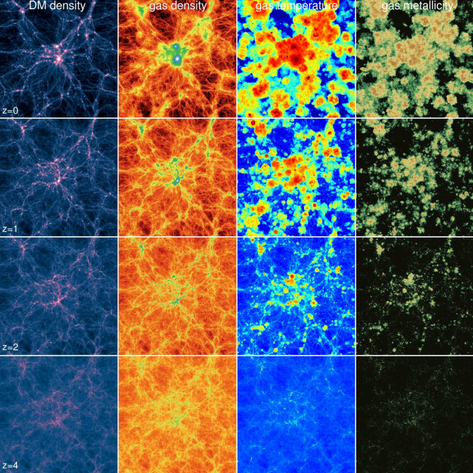]
.kol-1-3.width-70[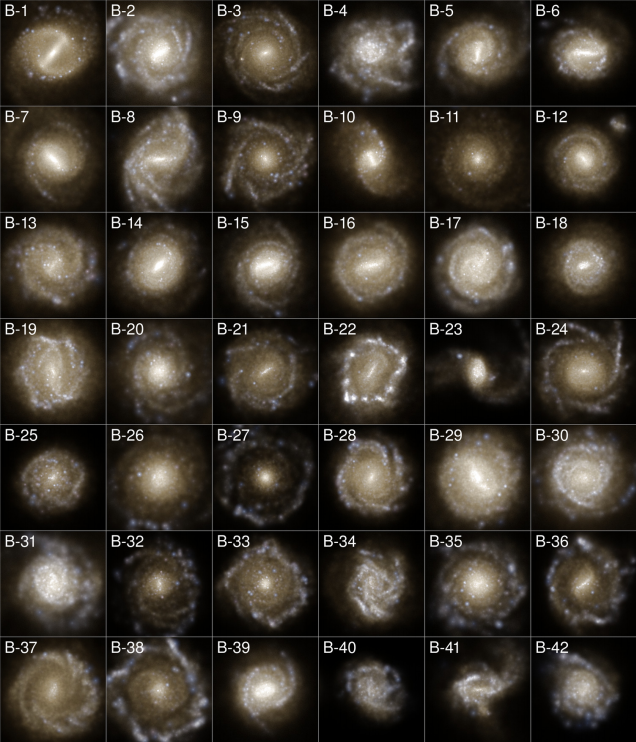]
]
Cosmology
]
]
.grid[
.kol-1-2.center[
.center.width-70[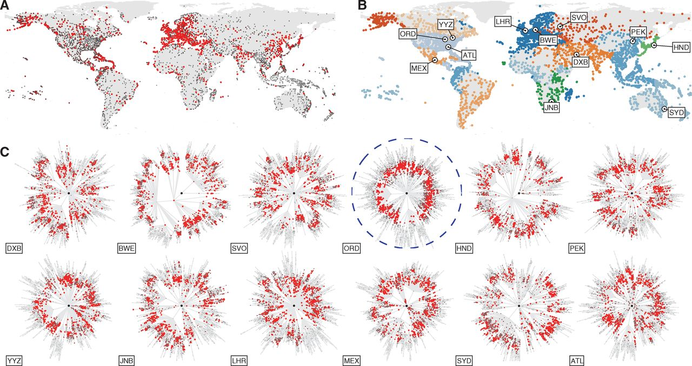]
Epidemiology
]
.kol-1-2.center[
.center.width-70[]
Climatology
]
]
.grid[
.kol-1-2.center[
.grid[
.kol-2-3.width-100[]
.kol-1-3.width-70[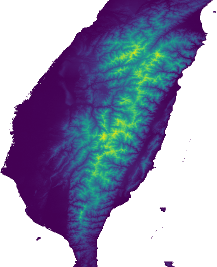]
]
Computational topography
]
.kol-1-2.center[
.center.width-70[]
Astronomy
]
]

---

class: middle

## Particle physics

.center.width-70[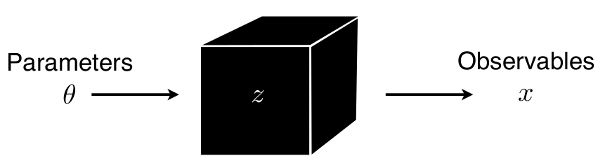]

.grid[
.kol-2-5[.width-100[]]
.kol-3-5[  .width-100[]]
]

---

class: middle

# Algorithms

---

class: middle

.grid.small-font[
.kol-1-5[]
.kol-2-5.center.bold[Treat the simulator  as a black box]
.kol-2-5.center.bold[Make use of  the inner structure]
]
.grid.center.small-font[
.kol-1-5.bold[   Learn a proxy for inference]
.kol-2-5[ .width-90[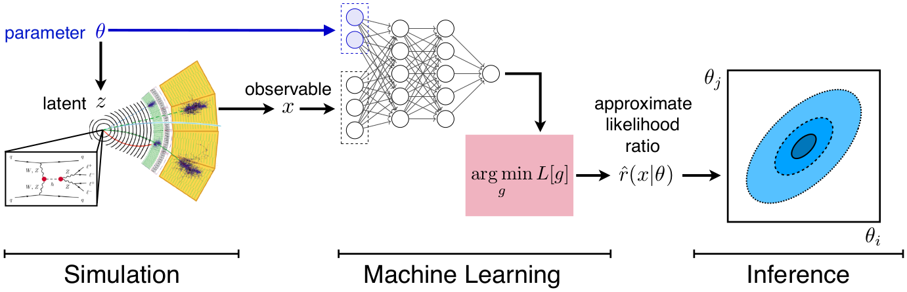]

Histograms of observables 
Neural density (ratio) estimation
]
.kol-2-5[.width-90[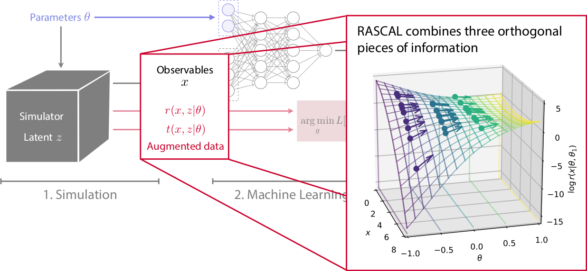]
Mining gold from implicit models
]
]
.grid.center.small-font[
.kol-1-5.bold[   Learn to control the simulator]
.kol-2-5[ .width-90[]

Adversarial variational optimization
]
.kol-2-5[.width-90[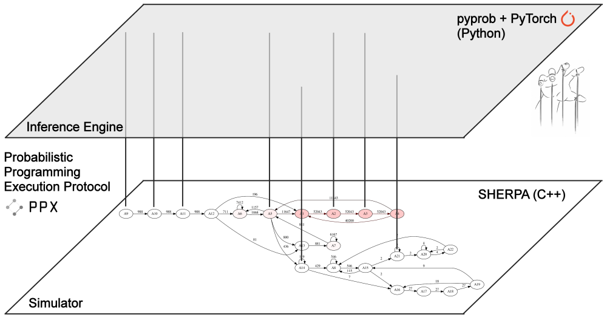]
Probabilistic programming
]
]

---

class: middle
count: false

.grid.small-font[
.kol-1-5[]
.kol-2-5.center.bold.red[Treat the simulator  as a black box]
.kol-2-5.center.bold.gray[Make use of  the inner structure]
]
.grid.center.small-font[
.kol-1-5.bold.red[   Learn a proxy for inference]
.kol-2-5[ .width-90[]

Histograms of observables 
Neural density (ratio) estimation
]
.kol-2-5.gray[.width-90[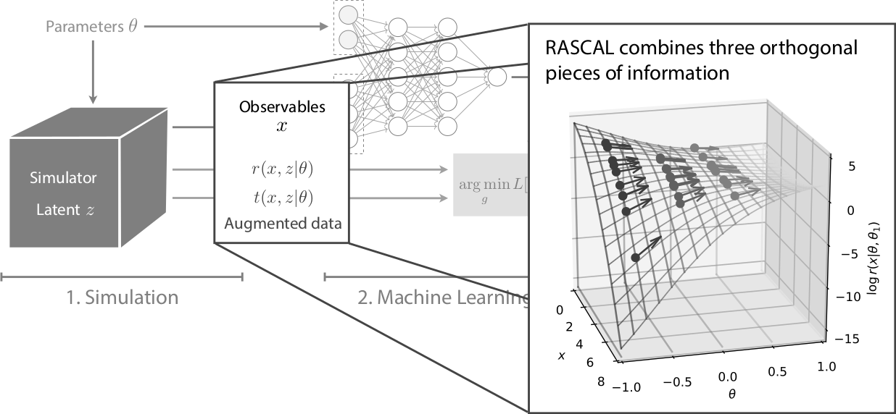]
Mining gold from implicit models
]
]
.grid.center.small-font.gray[
.kol-1-5.bold[   Learn to control the simulator]
.kol-2-5[ .width-90[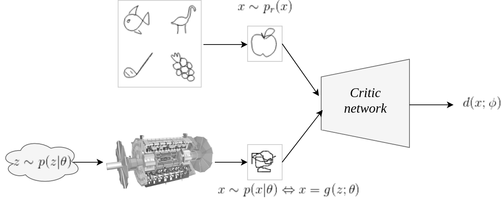]

Adversarial variational optimization
]
.kol-2-5[.width-90[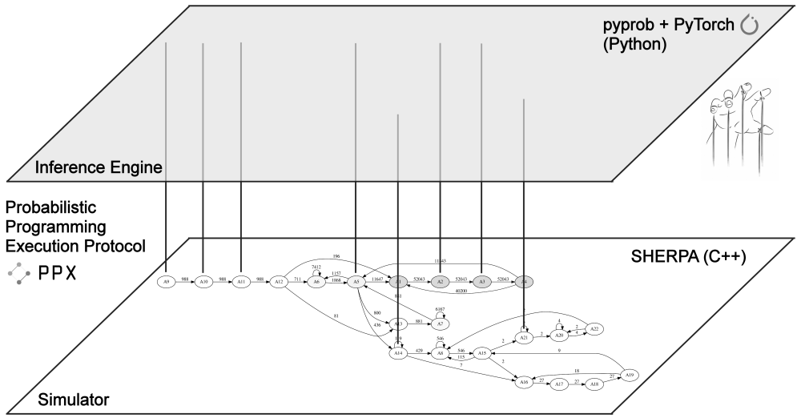]
Probabilistic programming
]
]

---

# The physicist's way

.grid[
.kol-3-4[
The Neyman-Pearson lemma states that the **likelihood ratio**
$$r(x|\theta\_0,\theta\_1) = \frac{p(x|\theta\_0)}{p(x|\theta\_1)}$$
is the most powerful test statistic to discriminate between a null hypothesis $\theta\_0$ and an alternative $\theta\_1$.
]
.kol-1-4[ .width-100[]]
]

.center.width-70[]

---

class: middle

.center.width-90[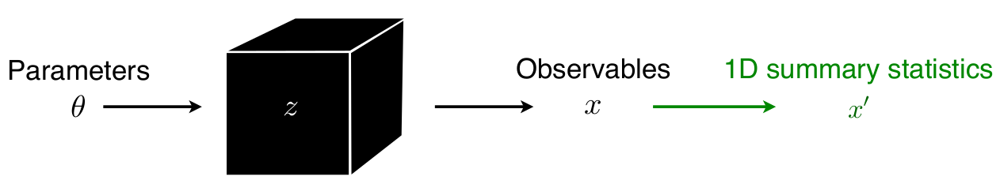]

.grid[
.kol-2-3[
Define a projection function $s:\mathcal{X} \to \mathbb{R}$ mapping observables $x$ to a summary statistics $x'=s(x)$.

Then, **approximate** the likelihood $p(x|\theta)$ as
$$p(x|\theta) \approx \hat{p}(x|\theta) = p(x'|\theta).$$

From this it comes
$$\frac{p(x|\theta\_0)}{p(x|\theta\_1)} \approx \frac{\hat{p}(x|\theta\_0)}{\hat{p}(x|\theta\_1)} = \hat{r}(x|\theta\_0,\theta\_1).$$
]
.kol-1-3.width-100[ ]
]

???

m4l = four-lepton invariant mass

---

class: middle

This methodology has worked great for physicists for the last 20-30 years, but ...

.grid[
.kol-1-2[
- Choosing the projection $s$ is difficult and problem-dependent.
- Often there is no single good variable: compressing to any $x'$ loses information.
- Ideally: analyse high-dimensional $x'$, including all correlations.

Unfortunately, filling high-dimensional histograms is **not tractable**.
]
.kol-1-2.center.width-90[]
]

Who you gonna call? *Machine learning*!

.footnote[Refs: Bolognesi et al, 2012 ([arXiv:1208.4018](https://arxiv.org/pdf/1208.4018.pdf))]

---

# Cᴀʀʟ

.center.width-90[]

 
.bold[Key insights]

- The likelihood ratio is *sufficient* for inference.
- Evaluating the likelihood ratio **does not** require evaluating the individual likelihoods.
- Supervised learning indirectly estimates likelihood ratios.

.footnote[Refs: Cranmer et al, 2016 ([arXiv:1506.02169](https://arxiv.org/pdf/1506.02169.pdf))]

---

class: middle

Supervised learning provides a way to **automatically** construct $s$:
- Let us consider a binary classifier $\hat{s}$ (e.g., a neural network) trained to distinguish $x \sim p(x|\theta\_0)$  from $x \sim p(x|\theta\_1)$.
- $\hat{s}$ is trained by minimizing the cross-entropy loss
$$
\begin{aligned}
L\_{XE}[\hat{s}] = -\mathbb{E}\_{p(x|\theta)\pi(\theta)} [&1(\theta=\theta\_0) \log \hat{s}(x) + \\\\
&1(\theta=\theta\_1) \log (1-\hat{s}(x))]
\end{aligned}
$$

---

class: middle

The solution $\hat{s}$ found after training  approximates the optimal classifier
$$\hat{s}(x) \approx s^\*(x) = \frac{p(x|\theta\_1)}{p(x|\theta\_0)+p(x|\theta\_1)}.$$

Therefore, $$r(x|\theta\_0,\theta\_1) \approx \hat{r}(x|\theta\_0,\theta\_1)=\frac{1-\hat{s}(x)}{\hat{s}(x)}$$

That is, **supervised classification is equivalent to likelihood ratio estimation** and can therefore be used for MLE inference.

---

class: middle

# Adversarial Variational Optimization

---

class: middle
count: false

.grid.small-font[
.kol-1-5[]
.kol-2-5.center.bold.red[Treat the simulator  as a black box]
.kol-2-5.center.bold.gray[Make use of  the inner structure]
]
.grid.center.small-font[
.kol-1-5.bold.gray[   Learn a proxy for inference]
.kol-2-5.gray[ .width-90[]

Histograms of observables 
Neural density (ratio) estimation
]
.kol-2-5.gray[.width-90[]
Mining gold from implicit models
]
]
.grid.center.small-font[
.kol-1-5.bold.red[   Learn to control the simulator]
.kol-2-5[ .width-90[]

Adversarial variational optimization
]
.kol-2-5.gray[.width-90[]
Probabilistic programming
]
]

---

class: middle

.center.width-90[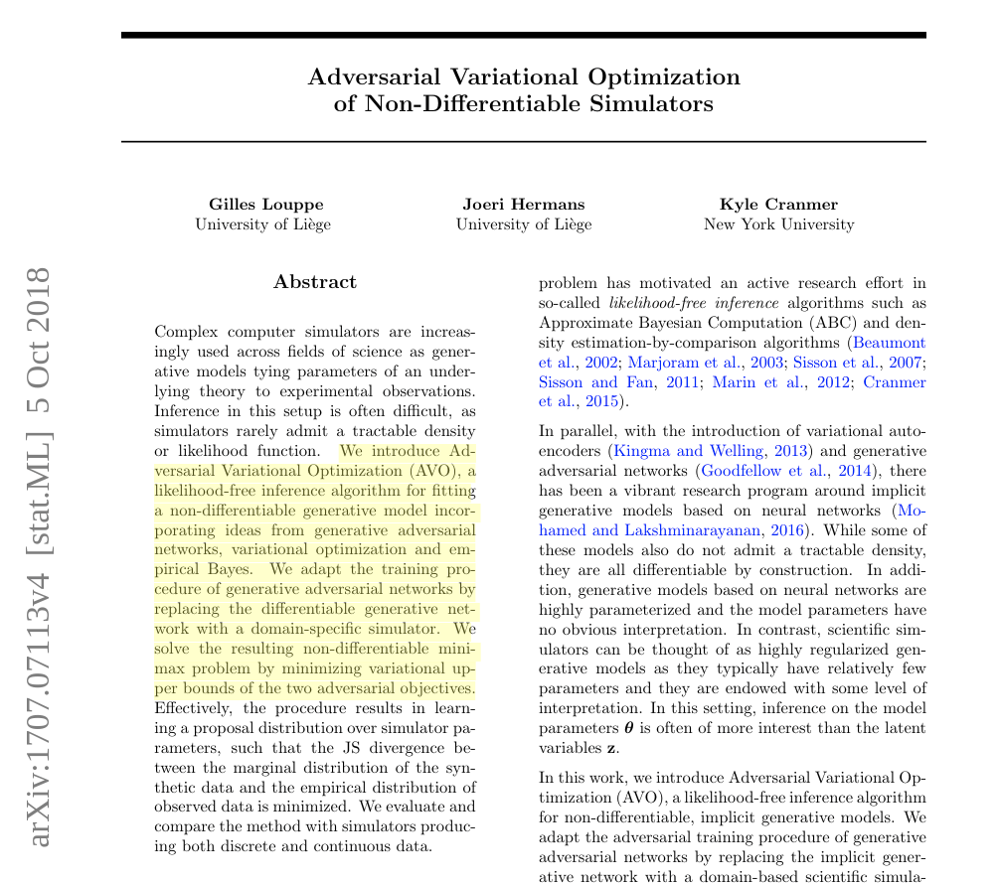]

---

# Generative adversarial networks

Express the task of learning a generative model as a two-player zero-sum game between two networks:
- The first network is a *generator*  $g(\cdot;\theta) : \mathcal{Z} \to \mathcal{X}$, mapping a latent space equipped with a prior distribution $p(\mathbf{z})$ to the data space, thereby inducing a distribution
$$\mathbf{x} \sim p(\mathbf{x};\theta) \Leftrightarrow \mathbf{z} \sim p(\mathbf{z}), \mathbf{x} = g(\mathbf{z};\theta).$$
- The second network $d(\cdot; \phi) : \mathcal{X} \to [0,1]$ is a **classifier** trained to distinguish between true samples $\mathbf{x} \sim p\_r(\mathbf{x})$ and generated samples $\mathbf{x} \sim p(\mathbf{x};\theta)$.

The central mechanism will be to use supervised learning to guide the learning of the generative model.

---

class: middle

.center.width-100[]
 

$$\arg \min\_\theta \max\_\phi \mathbb{E}\_{\mathbf{x} \sim p\_r(\mathbf{x})}\left[ \log d(\mathbf{x};\phi) \right] + \mathbb{E}\_{\mathbf{z} \sim p(\mathbf{z})}\left[ \log (1-d(g(\mathbf{z};\theta);\phi)) \right]$$

---

class: middle

In practice, the min-max solution is approximated using **alternating stochastic gradient descent** on the losses
$$
\begin{aligned}
\mathcal{L}\_d(\phi) &= \mathbb{E}\_{\mathbf{x} \sim p\_r(\mathbf{x} )} \left[ -\log(d(\mathbf{x} ;\phi)) \right] + \mathbb{E}\_{\mathbf{z}  \sim p(\mathbf{z})} \left[ -\log(1-d(g(\mathbf{z};\theta);\phi))\right] \\\\
\mathcal{L}\_g(\theta) &= \mathbb{E}\_{\mathbf{z} \sim p(\mathbf{z})} \left[ \log(1-d(g(\mathbf{z};\theta);\phi))\right],
\end{aligned}
$$
for which unbiased gradient estimates can be computed with Monte Carlo integration.

- For one step on $\theta$, we can optionally take $k$ steps on $\phi$, since we need the classifier to remain near optimal.
- Note that to compute $\nabla\_\theta \mathcal{L}\_g$, it is necessary to backprop all the way through $d$ before computing the partial derivatives with respect to $g$'s internals.

---

class: middle

.center.width-100[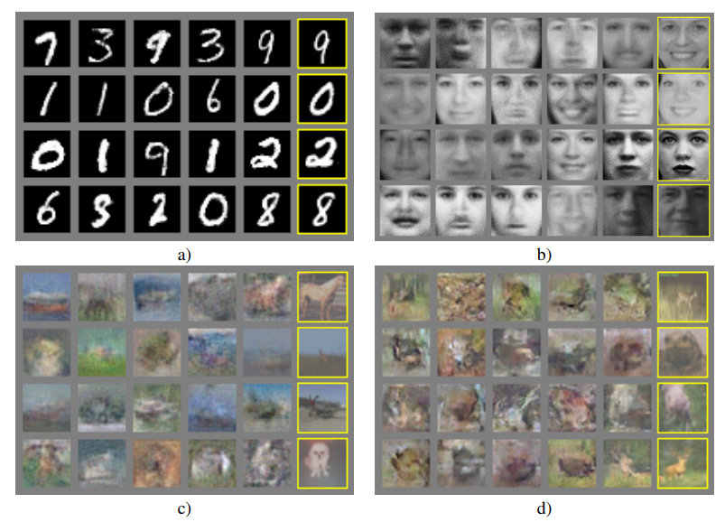]
.center[Goodfellow et al, 2014.]

---

class: middle

.center.width-100[]

---

class: middle

.center.width-50[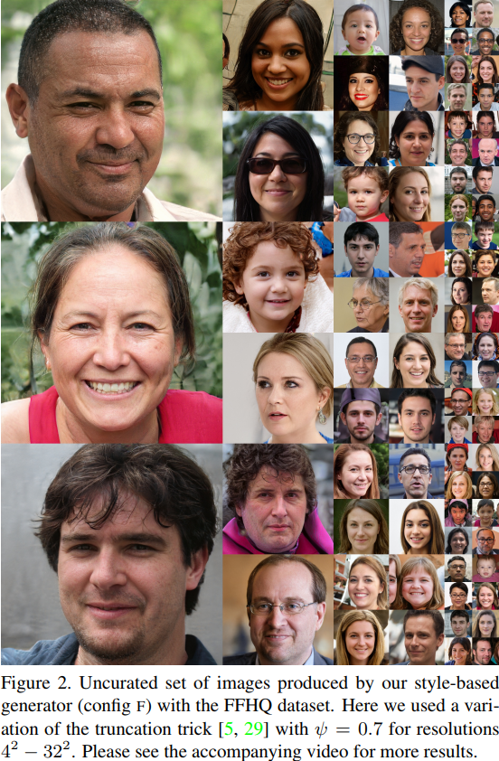]
.center[Karras et al, 2018.]

---

# Game analysis

Consider a generator $g$ fixed at $\theta$. Given a set of observations
$$\mathbf{x}\_i \sim p\_r(\mathbf{x}), i=1, ..., N,$$
we can generate a two-class dataset
$$\mathbf{d} = \\\{ (\mathbf{x}\_1, 1), ..., (\mathbf{x}\_N,1), (g(\mathbf{z}\_1;\theta), 0), ..., (g(\mathbf{z}\_N;\theta), 0)) \\\}.$$

The best classifier $d$ is obtained by minimizing
the cross-entropy
$$\begin{aligned}
\mathcal{L}\_d(\phi) &= -\frac{1}{2N} \left( \sum\_{i=1}^N \left[ \log d(\mathbf{x}\_i;\phi) \right] + \sum\_{i=1}^N\left[ \log (1-d(g(\mathbf{z}\_i;\theta);\phi)) \right] \right) \\\\
&\approx -\frac{1}{2} \left( \mathbb{E}\_{\mathbf{x} \sim p\_r(\mathbf{x})}\left[ \log d(\mathbf{x};\phi) \right] + \mathbb{E}\_{\mathbf{z} \sim p(\mathbf{z})}\left[ \log (1-d(g(\mathbf{z};\theta);\phi)) \right] \right)
\end{aligned}$$
with respect to $\phi$.

---

class: middle

Let us define the **value function**
$$V(\phi, \theta) =  \mathbb{E}\_{\mathbf{x} \sim p\_r(\mathbf{x})}\left[ \log d(\mathbf{x};\phi) \right] + \mathbb{E}\_{\mathbf{z} \sim p(\mathbf{z})}\left[ \log (1-d(g(\mathbf{z};\theta);\phi)) \right].$$

We have,
- $V(\phi, \theta)$ is high if $d$ is good at recognizing true from generated samples.

- If $d$ is the best classifier given $g$, and if $V$ is high, then this implies that
the generator is bad at reproducing the data distribution.

- Conversely, $g$ will be a good generative model if $V$ is low when $d$ is a perfect opponent.

Therefore, the ultimate goal is
$$\theta^\* = \arg \min\_\theta \max\_\phi V(\phi, \theta).$$

---

For a generator $g$ fixed at $\theta$, the classifier $d$ with parameters $\phi^\*\_\theta$ is optimal if and only if
$$\forall \mathbf{x}, d(\mathbf{x};\phi^\*\_\theta) = \frac{p\_r(\mathbf{x})}{p(\mathbf{x};\theta) + p\_r(\mathbf{x})}.$$

Therefore,
$$\begin{aligned}
&\min\_\theta \max\_\phi V(\phi, \theta) = \min\_\theta V(\phi^\*\_\theta, \theta) \\\\
&= \min\_\theta \mathbb{E}\_{\mathbf{x} \sim p\_r(\mathbf{x})}\left[ \log \frac{p\_r(\mathbf{x})}{p(\mathbf{x};\theta) + p\_r(\mathbf{x})} \right] + \mathbb{E}\_{\mathbf{x} \sim p(\mathbf{x};\theta)}\left[ \log \frac{p(\mathbf{x};\theta)}{p(\mathbf{x};\theta) + p\_r(\mathbf{x})} \right] \\\\
&= \min\_\theta \text{KL}\left(p\_r(\mathbf{x}) || \frac{p\_r(\mathbf{x}) + p(\mathbf{x};\theta)}{2}\right) \\\\
&\quad\quad\quad+ \text{KL}\left(p(\mathbf{x};\theta) || \frac{p\_r(\mathbf{x}) + p(\mathbf{x};\theta)}{2}\right) -\log 4\\\\
&= \min\_\theta 2\, \text{JSD}(p\_r(\mathbf{x}) || p(\mathbf{x};\theta)) - \log 4
\end{aligned}$$
where $\text{JSD}$ is the Jensen-Shannon divergence.

---

class: middle

In summary, solving the min-max problem
$$\theta^\* = \arg \min\_\theta \max\_\phi V(\phi, \theta)$$
is equivalent to  
$$\theta^\* = \arg \min\_\theta \text{JSD}(p\_r(\mathbf{x}) || p(\mathbf{x};\theta)).$$

Since $\text{JSD}(p\_r(\mathbf{x}) || p(\mathbf{x};\theta))$ is minimum if and only if
$p\_r(\mathbf{x}) = p(\mathbf{x};\theta)$, this proves that the min-max solution
corresponds to a generative model that perfectly reproduces the true data distribution.

---

# AVO

  
.center.width-100[]
 

.center[Replace $g$ with an actual scientific simulator!]

.footnote[
Refs: Louppe et al, 2017 ([arXiv:1707.07113](https://arxiv.org/pdf/1707.07113.pdf))
]

---

class: middle

## Key insights

- Replace the generative network with a non-differentiable forward simulator $g(\mathbf{z};\theta)$.
- Let the neural network critic figure out how to adjust the simulator parameters.
- Bypass the non-differentiability with variational optimization.

---

# Variational optimization

$$
\begin{aligned}
\min\_\theta f(\theta) &\leq \mathbb{E}\_{\theta \sim q(\theta | \psi)}[f(\theta)] = U(\psi) \\\\
\nabla\_\psi U(\psi) &= \mathbb{E}\_{\theta \sim q(\theta | \psi)} [f(\theta) \nabla_\psi \log q(\theta | \psi) ]
\end{aligned}
$$
.grid.center[
.kol-1-2[.width-100[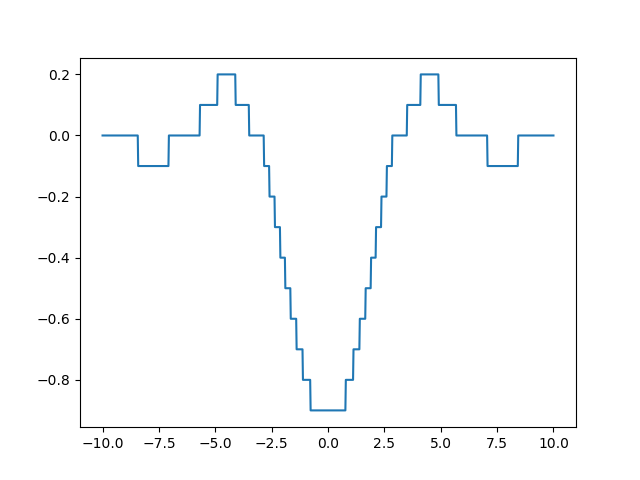]
 Piecewise constant $-\tfrac{\sin(x)}{x}$
]
.kol-1-2[.width-100[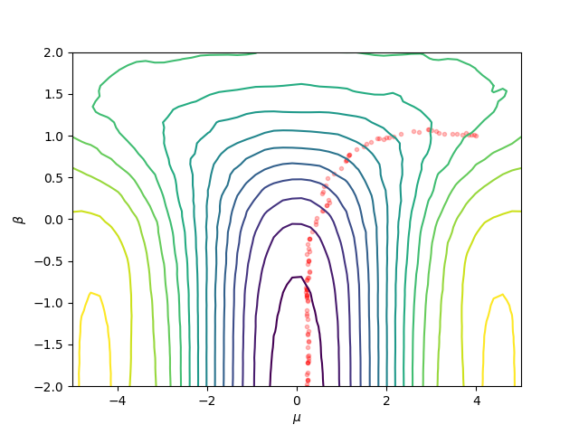]
$q(\theta | \psi=(\mu, \beta)) = \mathcal{N}(\mu, e^\beta)$
]
]

.center[(Similar to REINFORCE gradient estimates)]

---

class: middle

Variational optimization can be used to bypass the non-differentiability of the adversarial game by optimizing upper bounds of the adversarial objectives
$$
\begin{aligned}
U\_d(\phi) &= \mathbb{E}\_{\theta \sim q(\theta;\psi)} \left[\mathcal{L}\_d(\phi)\right] \\\\
U\_g(\psi) &= \mathbb{E}\_{\theta \sim q(\theta;\psi)} \left[\mathcal{L}\_g(\theta)\right]
\end{aligned}
$$
respectively over $\phi$ and $\psi$.

---

class: middle

.center.width-100[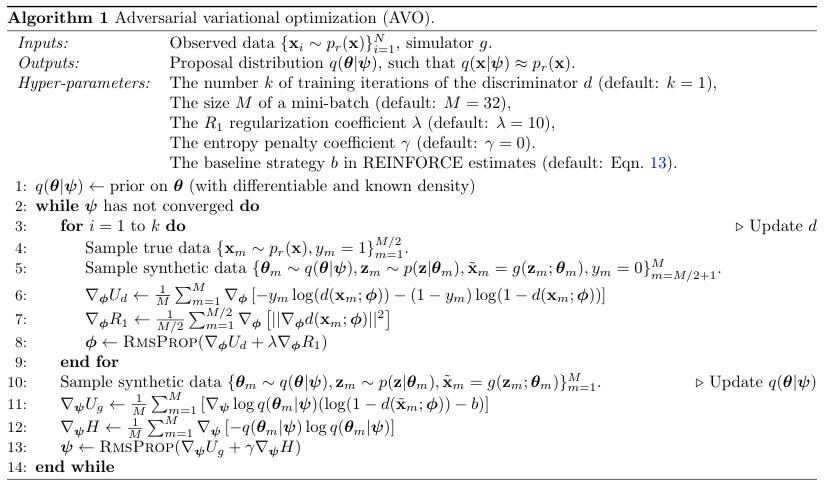]

---

class: middle

Operationally,
$$\mathbf{x} \sim q(\mathbf{x} | \psi) \Leftrightarrow \theta \sim q(\theta|\psi), \mathbf{z} \sim p(\mathbf{z}|\theta), \mathbf{x} = g(\mathbf{z}; \theta)$$

Therefore, $q(\mathbf{x} | \psi)$ is the marginal $\int p(\mathbf{x} | \theta) q(\theta|\psi) d\theta$ and the AVO procedure results in solving
$$\psi^* = \arg \min\_\psi \text{JSD}(p\_r(\mathbf{x}) || q(\mathbf{x}|\psi)).$$

- If the simulator $p(\mathbf{x} | \theta)$ is misspecified, $q(\mathbf{x} | \psi)$ will to attempt to smear the simulator to approach $p_r(\mathbf{x})$.
- If not, $q(\theta | \psi)$ will concentrate its mass around the true data-generating parameters.

---

class: middle

## Weaknesses

AVO can been seen through the lens of empirical Bayes, where the data are used to optimize a prior within the family $q(\theta|\psi)$.

- Therefore, if the simulator is well specified, AVO can *only* be used to determine a point estimate of the MLE. It does not enable likelihood-free posterior inference.
- The solution may change from one run to the next in case of local minima.

---

# Experiments

## Fitting a discrete Poisson distribution

.center.width-70[]

---

class: middle

## High-energy particle collisions

.grid[
.kol-1-2[  .width-100[]]
.kol-1-2[.width-100[]]
]

---

class: middle

.center.width-100[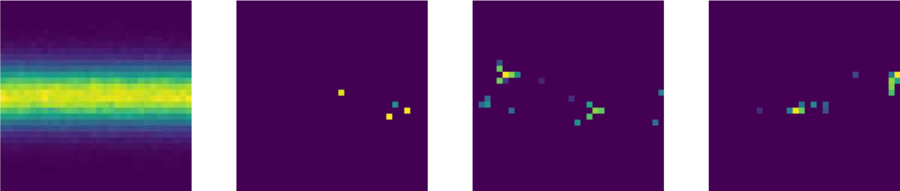]
$$z=0$$

.center[vs]

.center.width-100[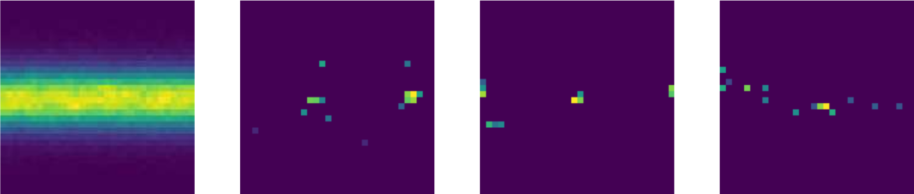]
$$z=1$$

---

class: middle

.center.width-80[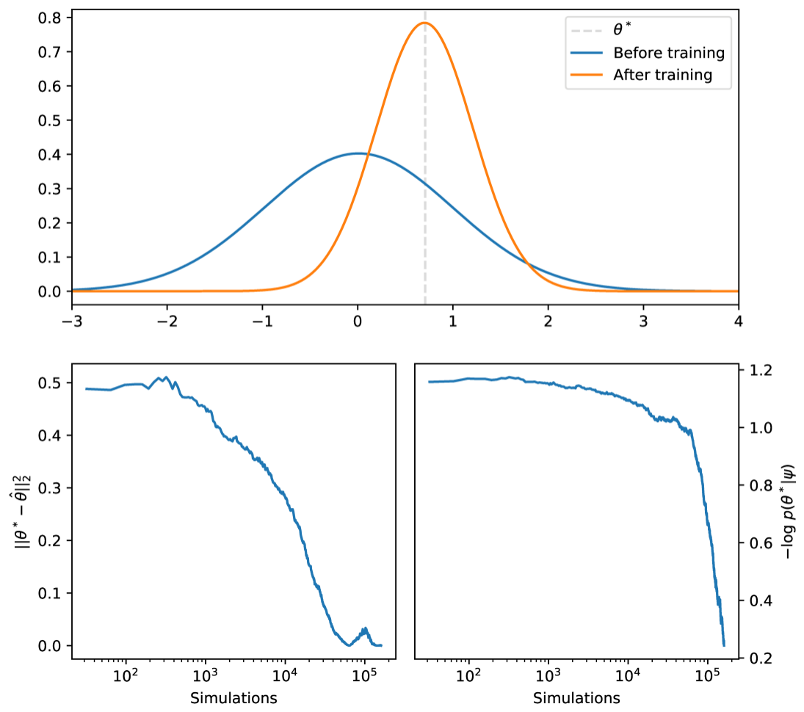]

---

class: middle

## Benchmarks

.center.width-70[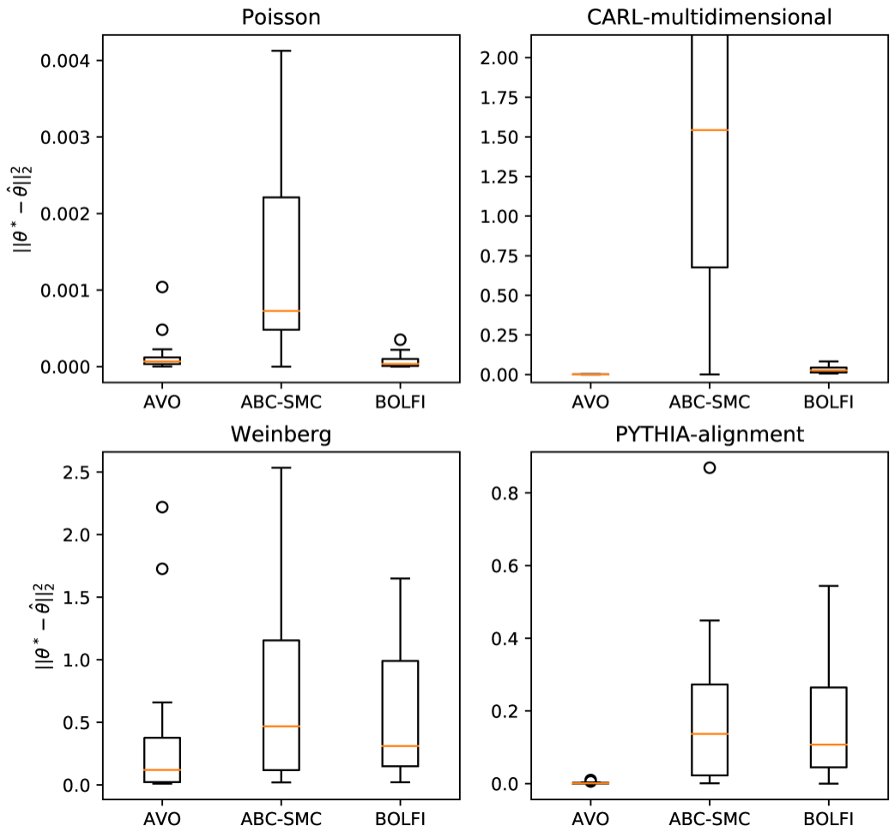]

---

# Summary

 
.center.width-70[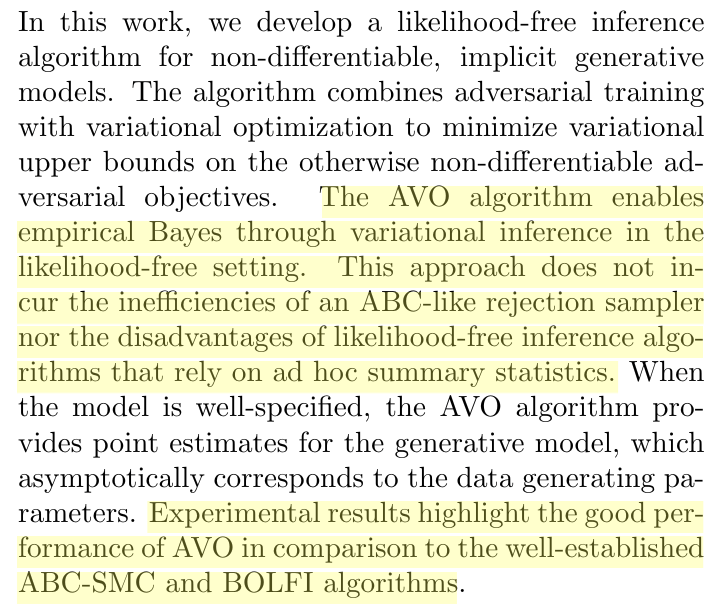]

---

class: end-slide, center
count: false

The end.
